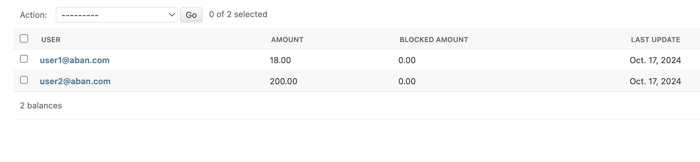

# Abantether test
- **user signup:** `POST /api/user/signup/`
- **user login:** `POST /api/user/login/`
- **place order:** `POST /api/order/`

for detail of payload please use Postman collection

## Balance Description
- created 2 users with proper amount of balance 
  - **blocked_amount**: This field represents the portion of the user's balance that is temporarily unavailable for use 
  - **amount**: This field represents the total balance in the user's account
  

  

  

## Order descriptions

1- user1 orders a quantity of ABAN token which the amount exceeds 10$, as assignment sample lets say 3 ABAN:

 

  

12$ will locked first then after calling buy_from_exchange() it deducted from balance(amount) so we will have:\
balance(user1):

  

then the orders will be:

  

now, an order for just 1 ABAN:

  

balance will be:

  

and orders will be:

  

now another 1 token but with user2.
balance will be:

  

and orders will be:

  

now for last order by user2 we expect to run buy_from_exchange() and synchronize all associated statuses:
balance will be:

  

and the orders:

  

